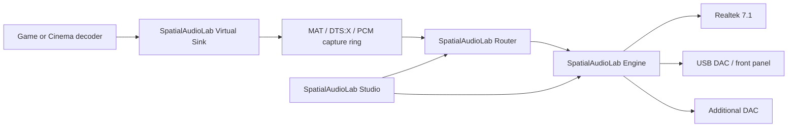

# SpatialAudioLab

Experimental Windows spatial-audio platform for capturing, decoding, rendering and routing
immersive audio to configurable multi-device speaker layouts.

SpatialAudioLab turns a virtual Windows spatial endpoint into a configurable analog output
distributed across one or more WASAPI devices. Profiles can describe standard layouts from 2.0
through 7.1.4, including 5.1.2, 5.1.4 and 7.1.2. Live game audio can arrive through Dolby MAT,
DTS:X or native PCM, while Cinema renders E-AC-3 JOC and TrueHD Atmos sources in real time.

> [!WARNING]
> This is research software, not a production audio driver or a finished installer. The current
> capture path uses a test-signed SysVAD driver, private Windows endpoint state observed on one
> Windows build, and licensed third-party spatial providers. A failed driver or endpoint experiment
> can temporarily remove audio until the driver or Windows audio services are restored.

## Current capabilities

| Area | Status |
| --- | --- |
| Dolby MAT game capture and render | Working live in 7.1.4 |
| DTS:X game capture and render | Working live in 7.1.4 |
| Native Windows Spatial PCM | Working live with layout-aware render/downmix |
| E-AC-3 JOC movie playback | Working in real time through PCM 7.1.4 |
| TrueHD Atmos movie playback | Working in real time through PCM 7.1.4 |
| Multiple audio endpoints | Working with adaptive clock-drift correction |
| Graphical speaker placement and routing | Working in SpatialAudioLab Studio |
| Per-channel RMS and peak meters | Working for all live bridge modes |
| Production-signed virtual driver | Not available |
| General-purpose Windows spatial provider | Research stage |

The original validated layout uses a Realtek 7.1 endpoint plus two stereo endpoints for four
height speakers. USB DACs, front-panel outputs and additional PCIe audio devices can be combined as
long as Windows exposes them as independent render endpoints. Endpoint IDs, container identity,
friendly names and channel capabilities are stored in each profile so hardware can be matched
again without relying on the development machine's names.

## Components

| Component | Purpose | Artifact |
| --- | --- | --- |
| **SpatialAudioLab Studio** | Speaker placement, endpoint routing, bridge controls and meters | `SpatialAudioLab.Studio.exe` |
| **SpatialAudioLab Cinema** | E-AC-3 JOC and TrueHD Atmos movie playback | `SpatialAudioLab.Cinema.exe` |
| **SpatialAudioLab Router** | Live MAT, DTS:X and PCM routing modes | Hosted by the CLI |
| **SpatialAudioLab Virtual Sink** | Test SysVAD endpoint and kernel-to-user capture ring | Windows driver package |
| **SpatialAudioLab CLI** | Diagnostics, capture, analysis and live routing engine | `SpatialAudioLab.CLI.exe` |
| **SpatialAudioLab Engine** | Multi-endpoint render, resampling and clock correction | C++ core |



## Requirements

- Windows 11 x64. Development and validation currently target build `10.0.26200.8655`.
- Visual Studio 2022 with Desktop C++ and driver development prerequisites.
- Windows SDK and WDK from the 26100 build family.
- .NET 8 SDK for Studio and Cinema.
- Administrator access and a boot with driver signature enforcement disabled for the test driver.
- Dolby Access for the Dolby MAT route or a licensed DTS Sound Unbound installation for DTS:X.
- [mpv](https://mpv.io/) for video presentation in SpatialAudioLab Cinema.
- At least one 48 kHz analog render endpoint; multiple endpoints are required for layouts that
  exceed the channel count of a single device.

Do not run games protected by kernel anti-cheat while the test-signed driver is loaded. Return to a
normal signed-driver boot before using those titles.

## Build from source

Clone the repository with its submodules:

```powershell
git clone --recurse-submodules https://github.com/barralutz/spatial-audio-lab.git
cd spatial-audio-lab
```

Apply the versioned SpatialAudioLab overlays to SysVAD and Cavern, inspect and install the driver
toolchain, then build the CLI and Studio:

```powershell
Set-ExecutionPolicy -Scope Process Bypass
./tools/Initialize-SpatialAudioLab.ps1
./tools/Install-WdkToolchain.ps1
./tools/Build-SpatialAudioLab.ps1
```

Cinema additionally needs the bundled TrueHD streaming decoder and its .NET dependencies:

```powershell
./tools/Install-Truehdd.ps1
./tools/Build-SpatialAudioLab.ps1 -Component Cinema
```

The virtual sink is a test driver. Read the complete one-boot procedure before installing it:

- [Virtual sink driver guide](driver/README.md)
- [Technical research notes](docs/TECHNICAL_NOTES.md)

## First run

Start the graphical layout and routing application:

```powershell
./tools/Start-SpatialAudioLabStudio.ps1
```

The included `configs/realtek-c1u-714.ini` describes the original development system and is an
example and migration source, not a default profile. Studio stores versioned profiles below
`%LocalAppData%\SpatialAudioLab\Profiles`, or below `Data\Profiles` when `portable.flag` exists next
to the application. Select your own render endpoints in the **Outputs** tab, assign logical
speakers to physical channels, test each speaker at low gain, and save the resulting profile before
starting a live bridge.

Studio can switch among four router modes:

- **Atmos (Windows)** for a Windows Dolby Atmos for Home Theater stream.
- **MAT nativo** for applications such as Battlefield 1 that open a legacy Dolby MLP/MAT 1.0
  carrier directly. Start this bridge before the application; the router automatically reopens
  physical WASAPI outputs if exclusive-stream negotiation invalidates them.
- **DTS:X** for a Windows DTS:X for Home Theater stream.
- **PCM 7.1.4** for a native static spatial bed and for Cinema playback.

All bridge modes run until explicitly stopped. The current latency profiles are Safe, Balanced and
Low; Balanced is the recommended starting point.

## Cinema

Install a desktop shortcut after building Cinema:

```powershell
./tools/Install-SpatialAudioLabCinemaShortcut.ps1
```

Open **SpatialAudioLab Cinema** from the desktop and select an `.mkv` or `.mka` file. The launcher
prepares the PCM 7.1.4 bridge, keeps mpv synchronized to the WASAPI render clock and supports both
E-AC-3 JOC and TrueHD Atmos inputs. Decode support does not imply that every title contains active
height objects; Studio's channel meters show what the renderer is producing.

## Project status

This repository records a working prototype and the investigation that produced it. Studio, Cinema
and the Engine now resolve their files from an installed or portable application root; they no
longer search for the repository, WSL media paths or the original `configs` and `captures`
directories at runtime. Driver installation and spatial-provider switching are still
Windows-build-sensitive and remain the next portability work.

Developers can assemble and verify the source-tree portable layout without committing build
artifacts by following the [portable runtime smoke test](docs/development/portable-runtime-smoke-test.md).

The detailed captures, format analysis, validation results and recovery procedures live in
[the technical notes](docs/TECHNICAL_NOTES.md). Contributions should preserve the separation between
the kernel capture path and user-mode codec/render logic.

## Third-party projects

SpatialAudioLab integrates or studies several projects as Git submodules, including Microsoft
SysVAD, Cavern, FFmpeg, `truehdd` and `dolby-atmos-encoder`. Each dependency retains its own license
and upstream history. The small source changes required by Virtual Sink and Cinema are kept as
[versioned patches](patches/README.md), so all submodule gitlinks resolve to public upstream
commits. Dolby, Dolby Atmos, DTS, DTS:X and Windows are trademarks of their respective owners;
SpatialAudioLab is an independent experimental project.
